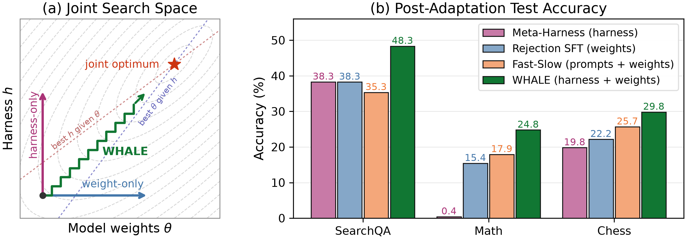

# WHALE: A Simple Recipe for Joint Harness-Weight Optimization

Code and instructions to reproduce the experiments in ***WHALE**: **W**eight-**H**arness **A**lternating **LE**arning*.

An agentic system is determined jointly by its model parameters and by the
harness that mediates context, tools and control flow. WHALE alternates the two:
each cycle trains the model for a small budget under the current harness, then
searches for a better harness under the updated model, and repeats. The weight
update is instantiated with online rejection-sampling fine-tuning (RSFT) and the
harness search with Meta-Harness (MH). The paper is
[WHALE: A Simple Recipe for Joint Harness-Weight
Optimization](https://arxiv.org/abs/2609.00196).



*(a) Updating only the model weights or only the harness moves along a single
axis of the objective; alternating small weight-update and harness-search steps
approaches the joint optimum. (b) Best test mean@8 accuracy of Qwen3.5-2B/4B
agents on seven-benchmark search QA, AIME 2024/2025 mathematical reasoning with
Python execution, and Lichess chess puzzles.*

## Contents

```
domains/
  search_qa/          seven-benchmark search question answering
  math_reasoning/     AIME 2024/2025 with a Python code-execution tool
  chess_puzzles/      Lichess puzzles
    verl/             vendored training framework (Apache-2.0, see NOTICE)
    environments/     the base harness h0 and its environment
    meta_harness/     the harness-search implementation and proposer skill
    scripts/          data preparation and the training driver
    run/              one launcher per experimental condition
run/lib/alternate.sh  the shared alternation loop
docs/data.md          every dataset: source, processing, and which split feeds what
docs/reproducing.md   how to run the twelve experiments
```

## Quick start

```bash
# 1. datasets                     -> docs/data.md
# 2. install the framework
cd domains/search_qa && pip install -e verl && cd ../..
# 3. run a condition              -> docs/reproducing.md
domains/search_qa/run/whale.sh
```

## The four conditions

| Launcher | Paper name | Description |
|---|---|---|
| `run/rsft_only.sh` | weight-only baseline | weights only, harness fixed at `h0` |
| `run/mh_only.sh` | harness-only baseline | harness only, model fixed at `theta0` |
| `run/whale.sh` | WHALE | alternates on a fixed per-cycle budget `(E, I)` |
| `run/adaptive_whale.sh` | adaptive WHALE | alternates, each phase ended by a patience rule |

Each is available for all three domains under `domains/<domain>/run/`.

## Scope

This repository contains the code paths exercised by those four conditions. Each
domain vendors its own copy of the training framework, because the three
experiments run against different modifications of it.

## Citation

If this repository is useful for your research, please cite the paper:

```bibtex
@misc{kim2026whalesimplerecipejoint,
      title={WHALE: A Simple Recipe for Joint Harness-Weight Optimization},
      author={Haechan Kim and Yoonho Lee and Gisang Lee and Chelsea Finn and Kangwook Lee},
      year={2026},
      eprint={2609.00196},
      archivePrefix={arXiv},
      primaryClass={cs.LG},
      url={https://arxiv.org/abs/2609.00196},
}
```

## License

Apache-2.0. See [LICENSE](LICENSE) and [NOTICE](NOTICE) for the vendored
components and their attribution.
